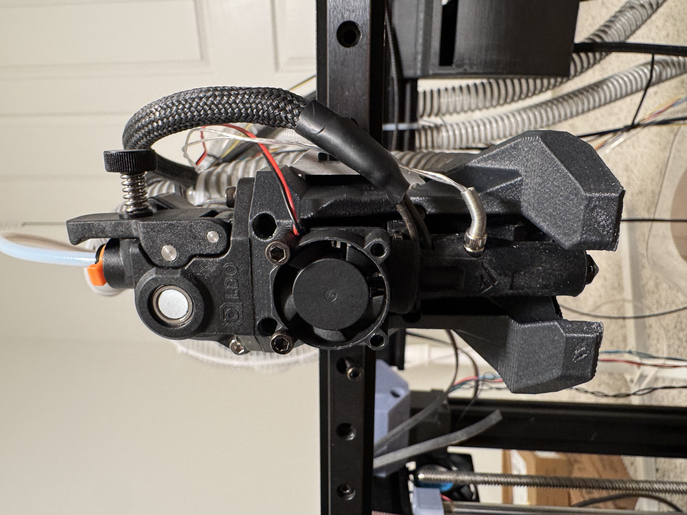
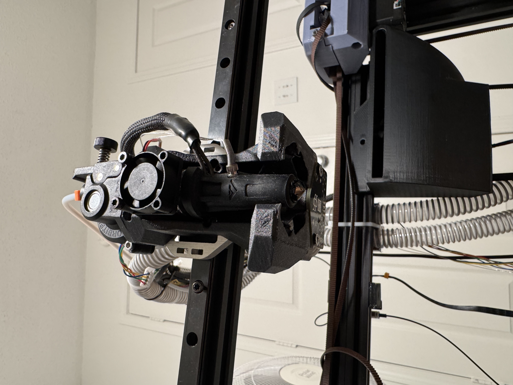

# Sphinx Toolhead

**File repository for the Sphinx toolhead**

Sphinx toolhead is aimed to be a high-performance toolhead with an emphasis on part cooling and rigidity.  
This project was built around the goal of printing a **quality 4-minute Benchy**.  

This project is a **work in progress!**

If you use this toolhead and modify or remix, please upload here or reach out and let me know on Instagram or Discord!  
📸 Instagram: [@practically_printed](https://instagram.com/practically_printed)  
💬 Discord: `rileyrandall`

---

## 🧩 Notes

Load the entire STEP file into Orca.  
The STEP file has built-in supports, so:

- **Main toolhead body:** 4 walls, 4 top/bottom layers, 25% infill  
- **Support bodies:** 2 walls, 3 top/bottom layers, 10–15% infill  

There are modeled supports for both the **Beacon mount** and **hotend mount**!

---

## 📸 Pictures

---

## 📈 Input Shaper Results

*(Add results or graphs here)*

---

## ⚙️ Mass Specs / COM

*(Add measurements or COM data here)*

---

## 🧰 Currently Supported Hardware

**Hotends:**  
- Goliath  

**Extruders:**  
- Orbiter v2.0  

**Probes:**  
- Beacon  

---

## 🔧 Hardware in Progress

**Hotends:**  
- Rapido UHF  
- Chube Air  
- Chube Compact  
- Dragon ACE UHF  

**Extruders:**  
- Sherpa Mini  
- Sherpa Micro  
- Vz-Hextrudort Low Plus  
- LGX  
- LGX Lite  

**Probes:**  
- Cartographer  
- BTT Eddy  

---

## 🌬️ Cooling Capability

Sphinx is designed for high-speed printing applications and built for **high-flow hotends**.  
Currently, high-speed printing faces two main bottlenecks: **flow** and **cooling**.  
Sphinx attempts to eliminate the cooling bottleneck as much as possible.  

- The printed outlet ducts are kept short to minimize aerodynamic losses.  
- Ducts interface with **two CPAP hoses** and are designed to work with **two WS7040 CPAP blowers** in parallel for maximum cooling power.  
- Currently using a **hacked air mattress compressor** that outputs roughly **750 L/min** of air.  

Most prints don’t need this level of cooling performance, so a single WS7040-optimized version is planned.

---

## 🧱 Mounting

Sphinx mounts to a **belt bracket** that attaches to **linear rail**.  
Currently, it is designed for **MGN12H** rail, but it can easily be remixed for **MGN9** if needed  
(prefer MGN12 for rigidity at high accelerations).  

There are **two versions** of the belt bracket:
- **Printed** version — uses M3 heat set inserts  
- **Sheet metal** version — designed to be **water jet or laser cut**, and M3 threads must be tapped manually  

Tested successfully with **Siraya Tech ABS-CF**, though any stiff material should work.

---

*© Sphinx Toolhead Project – Open-source and community-driven.*
