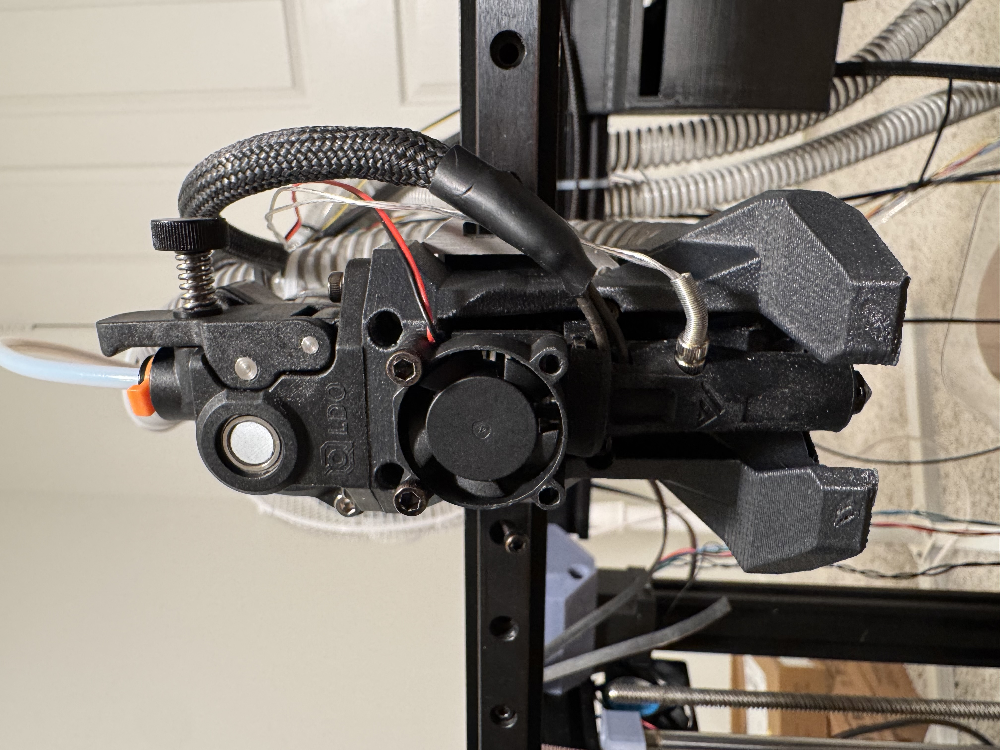
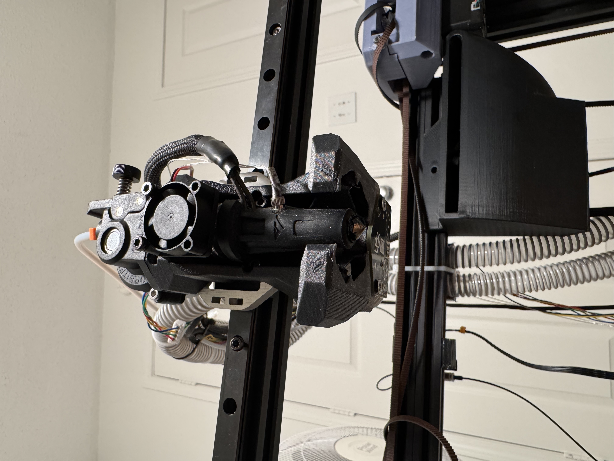
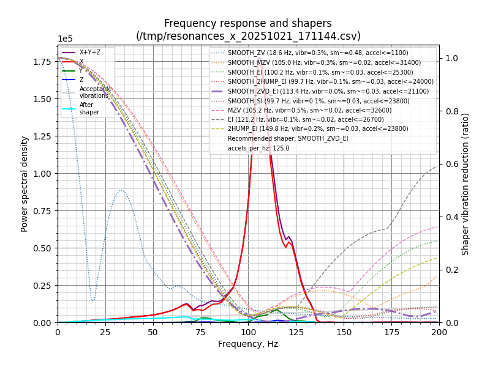
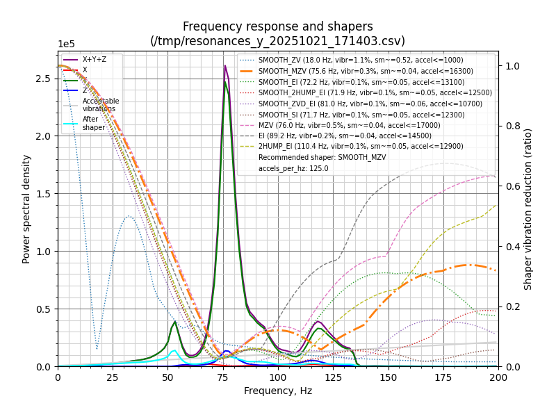

# Sphinx Toolhead

**File repository for the Sphinx toolhead**

Sphinx toolhead is aimed to be a high-performance toolhead with an emphasis on part cooling and rigidity.  
This project was built around the goal of printing a **quality 4-minute Benchy**.  

This toolhead is designed to be used with Monolith Gantry. Normal voron gantry support will be added in the future.

This project is a **work in progress!**

If you use this toolhead and modify or remix, please upload here or reach out and let me know on Instagram or Discord!  
📸 Instagram: [@practically_printed](https://instagram.com/practically_printed)  
💬 Discord: `rileyrandall`

---

## 🧩 Notes

Load the entire STEP file into Orca.  
The STEP file has built-in supports, so:

- **Main toolhead body:** 6 walls, 6 top/bottom layers, 25% infill    

---

## 📸 Pictures

---

## 📈 Input Shaper Results

| X IS Graph | Y IS Graph |
|:-----------:|:----------:|
|  |  |

*(These graphs were made with the printed toolhead bracket)*

---

## ⚙️ Mass Specs / COM

*(Add measurements or COM data here)*

---

## 🧰 Currently Supported Hardware

**Hotends:**  
- Tricorn
- Goliath
- CHC XL
- Rapido UHF 

**Extruders:**  
- Sherpa Mini  

**Probes:**  
- Beacon
- Cartographer

---

## 🔧 Hardware in Progress

**Hotends:**    
- Chube Compact  
- Dragon ACE UHF  

**Extruders:**  
- Orbiter 2.0 
- Sherpa Micro  
- Vz-Hextrudort Low Plus  
  

---

## 🌬️ Cooling Capability

The toolhead’s part cooling system is built specifically around the duct geometry to maximize usable airflow and thrust efficiency, with support for either WS9290 or WS7040 blowers. The 9290 duct option is very aggressive and great for speed printing, but the 7040 duct will not disappoint by any means. The goal of the ducts was to be able to print a perfect 5min benchy. Below is some data I collected that I used to optimize the toolhead ducts for both blowers.

## Mass Flow (g/s) vs. Outlet Area

| Outlet Area | WS9290 | WS7040 |
|------------|--------|--------|
| 80         | 3.0    | 1.7    |
| 100        | 3.6    | 2.0    |
| 120        | 4.5    | 2.7    |
| 135        | 4.6    | 2.9    |
| 150        | 5.2    | 2.8    |
| 165        | 5.5    | 2.9    |
| 180        | 5.6    | 3.0    |
| 210        | 5.9    | 3.0    |

## Force (grams) vs. Outlet Area

| Outlet Area | WS9290 | WS7040 |
|------------|--------|--------|
| 80         | 115    | 52     |
| 100        | 118    | 54     |
| 120        | 116    | 50     |
| 135        | 116    | 47     |
| 150        | 112    | 46     |
| 165        | 107    | 43     |
| 180        | 100    | 41     |
| 210        | 94     | 37     |

---

## Other Information

Sphinx is meant to be used with an mgn12H rail carriage. I higher preload x rail is encouraged for best Input Shaper results 

COM for this toolhead was optimized using CNC Sherpa Mini and Tricorn, but will also be should be pretty similar with all other hotends

Tested successfully with **Siraya Tech ABS-CF**, though any filled abs or better is recommended.

---

*© Sphinx Toolhead Project – Open-source and community-driven.*
